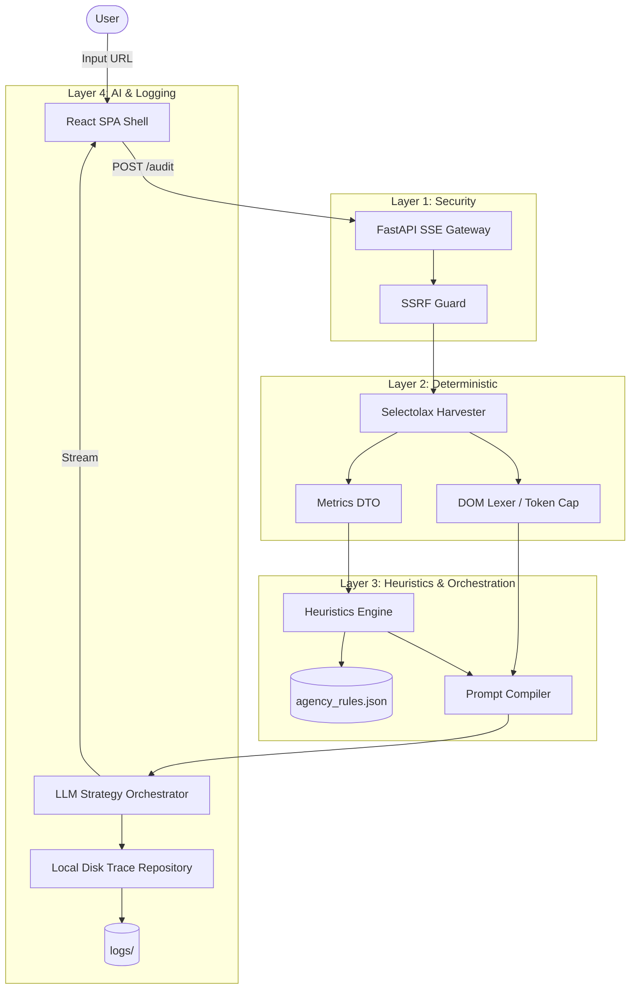

# Auditor-One: AI-Native Website Audit Tool

Auditor-One is a lightweight, AI-powered Website Audit Tool built for EIGHT25MEDIA. It combines deterministic data harvesting with advanced LLM reasoning to evaluate webpages and generate structured, actionable recommendations.

## 🚀 Setup Instructions

Follow these steps to run Auditor-One locally:

### 1. Prerequisites

- Python 3.11+
- Node.js 18+ (and npm)
- An OpenAI API Key (or Anthropic API Key)

### 2. Clone the Repository

```bash
git clone <repository_url>
cd Auditor-One
```

### 3. Backend Setup

Set up the Python virtual environment and install dependencies:

```bash
python3 -m venv .venv
source .venv/bin/activate
pip install -r backend/requirements.txt
```

Configure environment variables:

```bash
cp .env.example .env
```

Open `.env` and add your `OPENAI_API_KEY`.

Start the FastAPI server:

```bash
uvicorn backend.main:app --reload
```

The backend will run on `http://127.0.0.1:8000`.

### 4. Frontend Setup

In a new terminal window, navigate to the `frontend/` directory:

```bash
cd frontend
npm install
npm run dev
```

The frontend will run on `http://localhost:5173`. Open this URL in your browser to use the tool.

---

## 🏗️ Architecture Overview

The system implements a Backend-For-Frontend (BFF) Gateway pattern using FastAPI and Server-Sent Events (SSE) to stream deterministic data and non-deterministic AI generation to a React SPA.



### BFF Gateway Pattern

We use FastAPI as a Backend-For-Frontend (BFF) to encapsulate complex integrations. Instead of the frontend querying scraping APIs or LLM APIs directly, the BFF orchestrates the entire pipeline:

1. **Security**: Verifies URL.
2. **Scraping**: Harvests deterministic metrics quickly.
3. **Reasoning**: Compiles prompts and triggers the LLM.
4. **Streaming**: Multiplexes the execution states (stages, metrics, chunks, JSON, errors) into a single unified SSE stream consumed by the React UI.

---

## 🧠 AI Design Decisions & Prompting Strategy

### Token Economy Decisions

- **Why Selectolax over BeautifulSoup4?** We chose the `selectolax` C-parser because it routinely parses large DOM trees in under 10ms, whereas BS4 can take over 100ms. In an AI-native application, we want the LLM to spend token generation time, not scraping wait time.
- **Why the 12,800 Character Token Cap?** Instead of feeding massive raw HTML dumps to the LLM, the `DOMLexer` intelligently strips out semantic noise (scripts, styles, SVGs) and converts the tree to Markdown. The output is hard-capped at 12,800 characters (~3,200 tokens). This ensures predictable costs, avoids exceeding context windows, and forces the LLM to focus on the most important structural messaging of the page.

### Grounding & Agency Rules

We strictly separate the deterministic layer from the non-deterministic layer. Factual metrics (e.g., total images, links, H1 counts) are scraped first and locked into a `ScrapedMetricsDTO`.
These metrics are passed through a deterministic **Heuristics Engine** which checks them against `agency_rules.json` (e.g., "Missing H1", "Too few CTAs").
The LLM is prompted strictly using these verified metrics and rules, preventing it from hallucinating non-existent webpage elements.

### The Stream Splitter

To deliver an excellent UX, the AI output is streamed progressively to the frontend.
The LLM is instructed to generate Markdown insights first, followed by a strict delimiter `---REC_SPLIT---`, followed by a JSON array of actionable recommendations. The backend parses this stream in real-time, yielding markdown chunks to the UI immediately, while accumulating and verifying the JSON array before the final payload.

---

## ⚙️ Technical Trade-offs

### In-Memory vs. Disk Logging

For **Prompt Logs & Reasoning Traces**, we opted for a `LocalDiskTraceRepository`. The system writes the complete, untruncated system prompt, user prompt, deterministic state, and raw LLM output to the `logs/` directory asynchronously.

- *Trade-off*: We avoided setting up an external database (PostgreSQL/MongoDB) or dedicated observability tool (Langfuse) to keep setup simple and local. Writing to disk asynchronously avoids blocking the SSE stream, providing the required auditability without the infrastructure overhead.

### SSRF Defense Rationale

A tool that makes HTTP requests on behalf of a user is highly susceptible to Server-Side Request Forgery (SSRF).
We implemented a strict security layer that resolves target domains to IP addresses and rejects private, loopback, link-local, and AWS metadata IPs (`169.254.169.254`).

- *Trade-off*: Validating IPs manually is safe but slightly increases the TTFB (Time to First Byte). However, it is an absolutely necessary defense for cloud-deployed web scrapers.

### Strategy Pattern for LLMs

The architecture uses the **Strategy Pattern** for the `LLMOrchestrator` (`BaseLLMOrchestrator`, `OpenAIOrchestrator`, `AnthropicOrchestrator`).

- *Trade-off*: By abstracting the provider, we accept a slightly more complex backend structure instead of tightly coupling to the OpenAI SDK. This allows easy swapping of models via the `.env` file (`LLM_PROVIDER=anthropic`).

---

## 🔍 Deliverables Checklist

- [x] **GitHub Repository**: Complete solution included.
- [x] **Setup Instructions**: Available above.
- [x] **README**: Architecture, decisions, and trade-offs documented.
- [x] **Prompt Logs**: Reasoning traces are generated automatically and saved to the `/logs` directory during every execution.

---

## 🔮 Known Limitations & Future Improvements

If given more time, we would implement the following improvements:

1. **Playwright/Puppeteer Support**: The current HTTP request harvester (`httpx`) cannot execute JavaScript. Sites heavily reliant on React/Vue client-side rendering may return incomplete DOM trees. Adding an optional Playwright headful/headless layer would fix this.
2. **Streaming JSON Parsing**: Currently, the JSON recommendation array is accumulated in memory and parsed at the end. We would implement a streaming JSON parser (like `ijson`) to yield recommendation cards to the UI one by one as they are generated.
3. **Persisted History & Database**: We would replace the local disk logging with a PostgreSQL database, allowing users to revisit past audits and compare metrics over time.
4. **Enhanced Markdown Rendering**: Add customized Tailwind typography plugins to the frontend to render the LLM's markdown tables and code blocks more beautifully.
