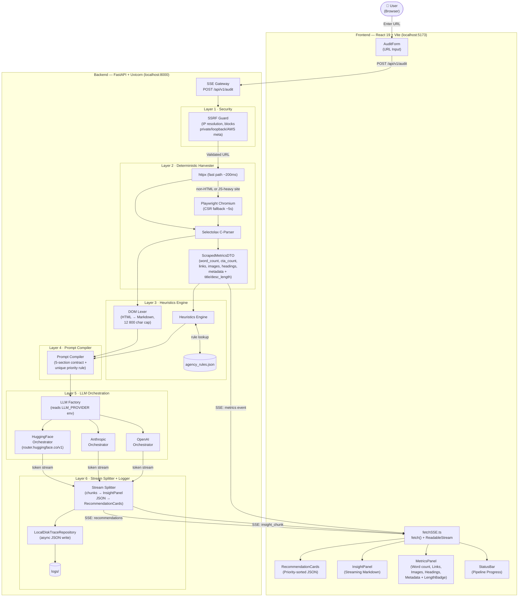

# Auditor-One · AI-Native Website Audit Tool

> AI-powered website auditor that combines deterministic harvesting with structured LLM reasoning to produce grounded, actionable insights — streamed live to the browser.

---

## Table of Contents

1. [Tech Stack](#-tech-stack)
2. [Prerequisites](#-prerequisites)
3. [Quick Start](#-quick-start)
4. [Step-by-Step Setup](#-step-by-step-setup)
   - [1 · Clone](#1--clone-the-repository)
   - [2 · Verify Python](#2--verify-python-version)
   - [3 · Create Virtual Environment](#3--create-the-virtual-environment)
   - [4 · Install Backend Dependencies](#4--install-backend-dependencies)
   - [5 · Install Playwright Browser](#5--install-playwright-chromium)
   - [6 · Configure Environment Variables](#6--configure-environment-variables)
   - [7 · Frontend Setup](#7--frontend-setup)
5. [Running the Application](#-running-the-application)
6. [Validate the Setup](#-validate-the-setup)
7. [Project Structure](#-project-structure)
8. [Architecture Diagram](#️-architecture-diagram)
9. [AI Design Decisions & Prompting Strategy](#-ai-design-decisions--prompting-strategy)
10. [Technical Trade-offs](#️-technical-trade-offs)
11. [Known Limitations & Future Improvements](#-known-limitations--future-improvements)

---

## 🛠 Tech Stack

| Layer | Technology | Version |
|---|---|---|
| **Frontend** | React + TypeScript | 19.x |
| **Frontend Build** | Vite | 8.x |
| **Frontend Styling** | TailwindCSS + Lucide Icons | — |
| **Backend** | FastAPI + Python | 3.11+ |
| **ASGI Server** | Uvicorn | — |
| **HTML Parser** | Selectolax (C-based) | — |
| **JS-Rendered Pages** | Playwright (Chromium) | — |
| **HTTP Client** | httpx | — |
| **Streaming Protocol** | Server-Sent Events (SSE) | — |
| **LLM Providers** | OpenAI / Anthropic / HuggingFace | — |

---

## ✅ Prerequisites

| Tool | Required Version | Check command |
|---|---|---|
| Python | **3.11 or higher** | `python3 --version` |
| pip | any recent version | `pip3 --version` |
| Node.js | **18 or higher** | `node --version` |
| npm | bundled with Node | `npm --version` |
| Git | any | `git --version` |

**LLM API key** — you need one of:

| Provider | Variable | Where to get it |
|---|---|---|
| HuggingFace _(recommended, free tier)_ | `HF_API_TOKEN` | [huggingface.co/settings/tokens](https://huggingface.co/settings/tokens) |
| OpenAI | `OPENAI_API_KEY` | [platform.openai.com/api-keys](https://platform.openai.com/api-keys) |
| Anthropic | `ANTHROPIC_API_KEY` | [console.anthropic.com](https://console.anthropic.com/) |

### Installing Python (macOS)

macOS ships with a **system Python 3.9** that has `pip` / `ensurepip` deliberately stripped by Apple. You **must** install a full Python 3.11+ from one of these sources:

**Option A — Homebrew (recommended):**
```bash
/bin/bash -c "$(curl -fsSL https://raw.githubusercontent.com/Homebrew/install/HEAD/install.sh)"
brew install python@3.11
```

After install, use `python3.11` explicitly (or `python3` if Homebrew sets it as default):
```bash
python3.11 --version   # → Python 3.11.x
pip3.11 --version      # → pip XX.X ...
```

**Option B — python.org installer:**

Download from [python.org/downloads](https://www.python.org/downloads/) and run the `.pkg`. Check **"Add Python to PATH"**. After installation verify:
```bash
python3 --version   # must show 3.11 or higher
pip3 --version      # must succeed without error
```

### Installing Python (Windows)

Download the installer from [python.org/downloads](https://www.python.org/downloads/). During installation:
- ✅ Check **"Add Python to PATH"**
- ✅ Check **"Install pip"**

Verify in PowerShell or Command Prompt:
```powershell
python --version    # → Python 3.11+
pip --version       # → pip XX.X ...
```

### Installing Node.js

Download from [nodejs.org](https://nodejs.org/) (LTS version). npm is bundled automatically.

---

## ⚡ Quick Start

> Requires Python 3.11+ with pip and Node 18+ already installed.

```bash
# Clone
git clone <repository_url>
cd Auditor-One

# Backend — run from repo root
python3 -m venv .venv
source .venv/bin/activate          # Windows: .venv\Scripts\activate
pip install -r backend/requirements.txt
playwright install chromium
cp .env.example .env               # Windows: copy .env.example .env
# → open .env and add your API key

# Terminal 1: start backend (repo root, venv active)
uvicorn backend.main:app --reload

# Terminal 2: start frontend
cd frontend && npm install && npm run dev
```

Open **http://localhost:5173**.

---

## 📖 Step-by-Step Setup

All backend commands run from the **repo root** (`Auditor-One/`) unless otherwise noted.

---

### 1 · Clone the Repository

```bash
git clone <repository_url>
cd Auditor-One
```

---

### 2 · Verify Python Version

#### macOS / Linux

```bash
python3 --version
```

The output **must** show `Python 3.11.x` or higher. If you see `3.9.x` or lower, or the command fails, install Python 3.11+ using the Homebrew or python.org instructions in the [Prerequisites](#installing-python-macos) section above before continuing.

Also confirm pip works:
```bash
pip3 --version
```

If `pip3` is not found but `python3` is fine, bootstrap it manually:
```bash
python3 -m ensurepip --upgrade
```

#### Windows

```powershell
python --version
pip --version
```

Both must succeed. If `python` is not found, verify "Add Python to PATH" was checked during installation and restart your terminal.

---

### 3 · Create the Virtual Environment

#### macOS / Linux

```bash
# Run from: Auditor-One/
python3 -m venv .venv
source .venv/bin/activate
```

Your prompt will change to show `(.venv)`. If you see an error like:

```
Error: Command '.venv/bin/python3', '-m', 'ensurepip' returned non-zero exit status 1
```

This means your system Python is the stripped Apple version. Fix:
```bash
# Option 1 — use Homebrew Python explicitly (replace 3.11 with your version)
python3.11 -m venv .venv
source .venv/bin/activate

# Option 2 — bootstrap pip after creating the venv without pip
python3 -m venv .venv --without-pip
source .venv/bin/activate
curl -sS https://bootstrap.pypa.io/get-pip.py | python3
```

Verify the venv is active and pip works:
```bash
which python3         # → .../Auditor-One/.venv/bin/python3
pip --version         # → pip XX.X from .venv
```

#### Windows — PowerShell

```powershell
# Run from: Auditor-One\
python -m venv .venv
.venv\Scripts\Activate.ps1
```

If you get an execution policy error:
```powershell
Set-ExecutionPolicy -ExecutionPolicy RemoteSigned -Scope CurrentUser
.venv\Scripts\Activate.ps1
```

#### Windows — Command Prompt

```cmd
python -m venv .venv
.venv\Scripts\activate.bat
```

Verify:
```
(venv) C:\...\Auditor-One>python --version
Python 3.11.x
```

---

### 4 · Install Backend Dependencies

> Virtual environment must be active before running this.

```bash
# Run from: Auditor-One/
pip install -r backend/requirements.txt
```

This installs: `fastapi`, `uvicorn`, `httpx`, `selectolax`, `sse-starlette`, `pydantic`, `openai`, `anthropic`, `playwright`, `python-dotenv`.

Verify a key package installed:
```bash
python3 -c "import fastapi; print('FastAPI OK')"
python3 -c "import selectolax; print('Selectolax OK')"
```

Both should print `OK`.

---

### 5 · Install Playwright Chromium

> Run this once. It downloads a headless Chromium browser (~130 MB) used for JavaScript-rendered pages.

```bash
# Run from: Auditor-One/  (venv active)
playwright install chromium
```

Expected output ends with:
```
Chromium X.X.X downloaded to ...
```

---

### 6 · Configure Environment Variables

Copy the example file:

**macOS / Linux:**
```bash
cp .env.example .env
```

**Windows PowerShell:**
```powershell
Copy-Item .env.example .env
```

**Windows Command Prompt:**
```cmd
copy .env.example .env
```

Open `.env` in any text editor and configure:

```ini
# ─── Choose your LLM provider ─────────────────────────────────────────────────
# Options: "openai" | "anthropic" | "hf"
LLM_PROVIDER=hf

# ─── Fill in ONLY the key for the provider you chose above ────────────────────
OPENAI_API_KEY=sk-your-openai-key
ANTHROPIC_API_KEY=sk-ant-your-anthropic-key
HF_API_TOKEN=hf_your-huggingface-access-token

# ─── HuggingFace settings (only relevant when LLM_PROVIDER=hf) ───────────────
HF_MODEL=meta-llama/Llama-3.3-70B-Instruct
HF_ENDPOINT=https://router.huggingface.co/v1

# ─── App settings (leave as-is for local development) ────────────────────────
FRONTEND_URL=http://localhost:5173
LOG_DIR=./logs
```

> **Important:** The `logs/` directory is created automatically on first run. You do not need to create it manually.

---

### 7 · Frontend Setup

Open a **new terminal window** (keep the backend terminal available). Navigate to the `frontend/` subdirectory:

```bash
# Run from: Auditor-One/frontend/
cd frontend
npm install
```

Expected output ends with:
```
added XXX packages in Xs
```

---

## 🚀 Running the Application

You need **two terminals open simultaneously**.

### Terminal 1 — Backend

```bash
# Directory: Auditor-One/  (repo root)
# Ensure venv is active — prompt should show (.venv)

# macOS/Linux — activate if not already:
source .venv/bin/activate

# Windows PowerShell — activate if not already:
# .venv\Scripts\Activate.ps1

uvicorn backend.main:app --reload
```

Wait for:
```
INFO:     Uvicorn running on http://127.0.0.1:8000
INFO:     Application startup complete.
```

### Terminal 2 — Frontend

```bash
# Directory: Auditor-One/frontend/
npm run dev
```

Wait for:
```
  VITE v8.x.x  ready in XXX ms
  ➜  Local:   http://localhost:5173/
```

Open **http://localhost:5173** in your browser.

### Port Reference

| Service | URL |
|---|---|
| React Frontend | http://localhost:5173 |
| FastAPI Backend | http://127.0.0.1:8000 |
| API Interactive Docs | http://127.0.0.1:8000/docs |

---

## ✔️ Validate the Setup

Run these checks from the repo root with the venv active to confirm everything is wired correctly before first use.

### Backend smoke test

```bash
# Run from: Auditor-One/  (venv active)
.venv/bin/pytest backend/tests/ -v
```

Expected:
```
backend/tests/test_harvester.py::test_selectolax_speed_and_accuracy PASSED
backend/tests/test_ssrf.py::test_ssrf_rejection PASSED
backend/tests/test_stream_splitter.py::test_sse_delimiter_splitting_and_fallback PASSED
backend/tests/test_stream_splitter.py::test_recommendation_priority_normalization PASSED

4 passed
```

### Environment check

```bash
python3 -c "
from dotenv import load_dotenv; load_dotenv()
import os
provider = os.getenv('LLM_PROVIDER', 'NOT SET')
key_map = {'openai': 'OPENAI_API_KEY', 'anthropic': 'ANTHROPIC_API_KEY', 'hf': 'HF_API_TOKEN'}
key = os.getenv(key_map.get(provider, ''), '')
print(f'Provider : {provider}')
print(f'API Key  : {key[:8]}... ({len(key)} chars)' if key else 'API Key  : MISSING')
print(f'Frontend : {os.getenv(\"FRONTEND_URL\", \"NOT SET\")}')
print(f'Log Dir  : {os.getenv(\"LOG_DIR\", \"NOT SET\")}')
"
```

All four lines must show real values (no `NOT SET` or `MISSING`).

### API reachability check (backend must be running)

```bash
curl -s http://127.0.0.1:8000/docs | grep -q "Swagger" && echo "Backend OK" || echo "Backend not reachable"
```

### Frontend build check (optional)

```bash
# Run from: Auditor-One/frontend/
npm run build
```

Should end with `✓ built in XXXms` and no TypeScript errors.

---

## 📁 Project Structure

```
Auditor-One/                     ← repo root (backend commands run here)
│
├── .env                         ← your local credentials (git-ignored, never committed)
├── .env.example                 ← template — copy this to .env
├── agency_rules.json            ← heuristic rule definitions
│
├── backend/                     ← FastAPI application
│   ├── main.py                  ← app entry point, CORS
│   ├── config.py                ← pydantic-settings env loader
│   ├── requirements.txt         ← Python dependencies
│   │
│   ├── api/
│   │   └── router.py            ← POST /api/v1/audit SSE endpoint
│   │
│   ├── models/
│   │   └── dto.py               ← Pydantic DTOs (ScrapedMetricsDTO, MetadataDTO …)
│   │
│   ├── security/
│   │   └── ssrf_guard.py        ← IP resolution + private-range SSRF rejection
│   │
│   ├── scraper/
│   │   └── harvester.py         ← httpx-first + Playwright fallback harvester
│   │
│   ├── heuristics/
│   │   ├── lexer.py             ← DOM → Markdown, 12 800 char cap
│   │   └── engine.py            ← Rule evaluator against agency_rules.json
│   │
│   ├── prompts/
│   │   └── compiler.py          ← System prompt + user prompt builder
│   │
│   ├── llm/
│   │   ├── base.py              ← BaseLLMOrchestrator interface
│   │   ├── factory.py           ← Provider factory (reads LLM_PROVIDER)
│   │   ├── openai_orchestrator.py
│   │   ├── anthropic_orchestrator.py
│   │   └── hf_orchestrator.py   ← HuggingFace via router.huggingface.co/v1
│   │
│   ├── logging/
│   │   └── trace_repository.py  ← Async disk writer for reasoning traces
│   │
│   └── tests/
│       ├── test_harvester.py
│       ├── test_ssrf.py
│       └── test_stream_splitter.py
│
├── frontend/                    ← React + Vite SPA (npm commands run here)
│   ├── package.json
│   └── src/
│       ├── App.tsx              ← Main layout, state orchestration
│       ├── api/fetchSSE.ts      ← fetch() + ReadableStream SSE client
│       ├── components/
│       │   ├── AuditForm.tsx
│       │   ├── StatusBar.tsx
│       │   ├── MetricsPanel.tsx  ← Metrics display + LengthBadge SEO pills
│       │   ├── InsightPanel.tsx  ← Streaming markdown AI analysis
│       │   ├── RecommendationCards.tsx
│       │   └── ErrorBanner.tsx
│       └── types/audit.ts       ← TypeScript interfaces for all API shapes
│
└── logs/                        ← Auto-generated reasoning trace JSON files (git-ignored)
```

---

## 🏗️ Architecture Diagram



### Data Flow Summary

| Stage | What happens | Source file |
|---|---|---|
| **1 — Input** | User submits URL | Frontend |
| **2 — SSRF Check** | IP resolved, private ranges blocked | `security/ssrf_guard.py` |
| **3 — Harvest** | httpx fetches HTML; Playwright fallback for CSR/non-HTML pages | `scraper/harvester.py` |
| **4 — Parse** | Selectolax extracts metrics into DTOs | `scraper/harvester.py` |
| **5 — Metrics SSE** | `metrics` event streamed to frontend immediately | SSE Gateway |
| **6 — Lex DOM** | HTML stripped to Markdown, capped at 12 800 chars | `heuristics/lexer.py` |
| **7 — Heuristics** | `agency_rules.json` evaluated against DTOs | `heuristics/engine.py` |
| **8 — Prompts** | System + user prompts compiled with metric values | `prompts/compiler.py` |
| **9 — LLM Stream** | Provider chosen by `LLM_PROVIDER`; tokens streamed | `llm/` |
| **10 — Split** | `---REC_SPLIT---` delimiter separates markdown from JSON | SSE Gateway |
| **11 — Display** | Markdown → InsightPanel; JSON → RecommendationCards | Frontend |
| **12 — Log** | Full trace written async to `logs/` | `logging/trace_repository.py` |

---

## 🧠 AI Design Decisions & Prompting Strategy

### 5-Section Output Contract

The system prompt enforces a strict structure the LLM must follow:

```
## SEO Structure
## Messaging Clarity
## CTA Usage
## Content Depth
## UX Concerns
---REC_SPLIT---
[JSON array of 3–5 recommendations]
```

Each recommendation must match:
```json
{
  "priority": 1,
  "category": "SEO | Copywriting | UX | Conversion",
  "issue": "...",
  "actionable_recommendation": "...",
  "metric_reference": "cta_count | metadata.title_length | ..."
}
```

Priority integers must be **strictly unique and sequential** — the backend normalises duplicates as a safety net.

### Token Economy

- **Selectolax over BeautifulSoup4** — C-parser processes large DOMs in under 10ms vs 100ms+ for BS4.
- **12 800-char cap** — The DOM Lexer strips scripts/styles/SVGs and converts to Markdown. Cap keeps cost predictable and prevents context overflow.

### Hybrid Harvester

| Path | When | Speed |
|---|---|---|
| httpx | Server-rendered HTML | ~200ms |
| Playwright | Non-HTML Content-Type or thin shell (JS/CSR) | ~5s |

Playwright wait strategy: `domcontentloaded` (30s timeout) + `wait_for_function(innerText > 100 chars, 12s)`.

---

## ⚙️ Technical Trade-offs

| Decision | Trade-off |
|---|---|
| **Strategy Pattern for LLM providers** | Slightly more files, but zero coupling — swap providers via `.env` only |
| **SSE over WebSockets** | One-way, simpler; no WebSocket upgrade handshake needed |
| **`fetch()` + `ReadableStream`** | `EventSource` is GET-only; audit endpoint needs `POST` to carry the URL |
| **Local disk trace logging** | Avoids requiring a database; async write never blocks the stream |
| **SSRF IP resolution** | Adds ~5ms TTFB, but is non-negotiable for a web-scraping proxy |

---

## 🔮 Known Limitations & Future Improvements

1. **Streaming JSON parsing** — Recommendations are buffered until `---REC_SPLIT---`. `ijson` could yield cards one by one.
2. **Audit history** — Replace `logs/` disk writes with SQLite/PostgreSQL for time-series comparison.
3. **Auth layer** — No authentication; suitable for local dev only.
4. **Rate limiting** — No per-IP throttle; a cloud deployment needs `slowapi` or a gateway limiter.

---

## 🔍 Deliverables Checklist

- [x] **Source Code** — Full monorepo (FastAPI backend + React frontend)
- [x] **Setup Instructions** — Per-OS, per-directory, step-by-step (this document)
- [x] **Architecture Diagram** — Multi-layer Mermaid flowchart above
- [x] **Prompt Logs** — Auto-generated on every audit run to `logs/reasoning_trace_*.json`
- [x] **Pytest Suite** — `backend/tests/` covers SSRF, harvester speed, SSE splitting, priority normalisation
