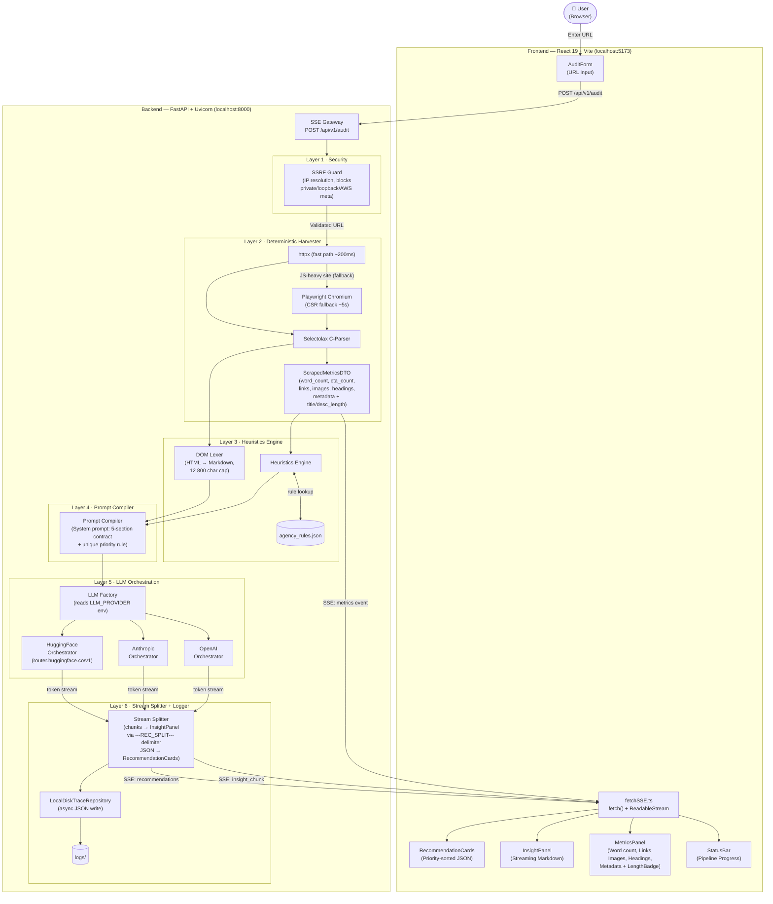

# Auditor-One · AI-Native Website Audit Tool

> AI-powered website auditor that combines deterministic harvesting with structured LLM reasoning to produce grounded, actionable insights — streamed live to the browser.

---

## Table of Contents

1. [Tech Stack](#-tech-stack)
2. [Prerequisites](#-prerequisites)
3. [Quick Start (All Platforms)](#-quick-start-all-platforms)
4. [Step-by-Step Setup](#-step-by-step-setup)
   - [1 · Clone](#1--clone-the-repository)
   - [2 · Environment Variables](#2--configure-environment-variables)
   - [3 · Backend (macOS / Linux)](#3a--backend-setup--macos--linux)
   - [3 · Backend (Windows)](#3b--backend-setup--windows)
   - [4 · Frontend](#4--frontend-setup)
5. [Running the Application](#-running-the-application)
6. [Project Structure](#-project-structure)
7. [Architecture Diagram](#️-architecture-diagram)
8. [AI Design Decisions & Prompting Strategy](#-ai-design-decisions--prompting-strategy)
9. [Technical Trade-offs](#️-technical-trade-offs)
10. [Known Limitations & Future Improvements](#-known-limitations--future-improvements)

---

## 🛠 Tech Stack

| Layer | Technology | Version |
|---|---|---|
| **Frontend** | React + TypeScript | 19.x |
| **Frontend Build** | Vite | 8.x |
| **Frontend Styling** | TailwindCSS + Lucide Icons | — |
| **Backend** | FastAPI + Python | 3.11+ |
| **ASGI Server** | Uvicorn | — |
| **HTML Parser** | Selectolax (C-based) | — |
| **JS-Rendered Pages** | Playwright (Chromium) | — |
| **HTTP Client** | httpx | — |
| **Streaming Protocol** | Server-Sent Events (SSE) | — |
| **LLM Providers** | OpenAI / Anthropic / HuggingFace | — |

---

## ✅ Prerequisites

Install the following before proceeding:

- **Python 3.11+** — [python.org](https://www.python.org/downloads/)  
  _(Windows: check "Add Python to PATH" during installation)_
- **Node.js 18+** with **npm** — [nodejs.org](https://nodejs.org/)
- **Git** — [git-scm.com](https://git-scm.com/)
- An API key for **at least one** of the supported LLM providers:

| Provider | Variable | Where to get it |
|---|---|---|
| OpenAI | `OPENAI_API_KEY` | [platform.openai.com](https://platform.openai.com/api-keys) |
| Anthropic | `ANTHROPIC_API_KEY` | [console.anthropic.com](https://console.anthropic.com/) |
| Hugging Face | `HF_API_TOKEN` | [huggingface.co/settings/tokens](https://huggingface.co/settings/tokens) |

---

## ⚡ Quick Start (All Platforms)

> For a fast first run — assumes Python 3.11+ and Node 18+ are installed.

```bash
# 1. Clone
git clone <repository_url>
cd Auditor-One

# 2. Backend (run from repo root)
python3 -m venv .venv
source .venv/bin/activate          # Windows: .venv\Scripts\activate
pip install -r backend/requirements.txt
playwright install chromium
cp .env.example .env               # Windows: copy .env.example .env
# → edit .env and fill in your API key and LLM_PROVIDER

# 3. Start backend (repo root, venv active)
uvicorn backend.main:app --reload

# 4. Start frontend (new terminal window, inside frontend/)
cd frontend
npm install
npm run dev
```

Open **http://localhost:5173** in your browser.

---

## 📖 Step-by-Step Setup

### 1 · Clone the Repository

Run from any directory where you want the project to live:

```bash
git clone <repository_url>
cd Auditor-One
```

All subsequent **backend commands** are run from this root `Auditor-One/` directory unless stated otherwise.

---

### 2 · Configure Environment Variables

Copy the example env file and fill in your credentials.

**macOS / Linux:**
```bash
# Run from: Auditor-One/  (repo root)
cp .env.example .env
```

**Windows PowerShell:**
```powershell
# Run from: Auditor-One\  (repo root)
Copy-Item .env.example .env
```

**Windows Command Prompt:**
```cmd
copy .env.example .env
```

Now open `.env` in your editor and configure it:

```ini
# ─── LLM Provider ─────────────────────────────────────────────────────────────
# Choose ONE: "openai" | "anthropic" | "hf"
LLM_PROVIDER=hf

# ─── Provider Keys (configure only the provider you chose above) ──────────────
OPENAI_API_KEY=sk-your-openai-key
ANTHROPIC_API_KEY=sk-ant-your-anthropic-key
HF_API_TOKEN=hf_your-huggingface-access-token

# ─── HuggingFace Inference Router (only needed when LLM_PROVIDER=hf) ──────────
HF_MODEL=meta-llama/Llama-3.3-70B-Instruct
HF_ENDPOINT=https://router.huggingface.co/v1

# ─── Application ──────────────────────────────────────────────────────────────
FRONTEND_URL=http://localhost:5173
LOG_DIR=./logs
```

> **Note:** Only fill in the key for the provider you selected with `LLM_PROVIDER`. The other keys are ignored.

---

### 3a · Backend Setup — macOS / Linux

All commands below run from the **repo root** (`Auditor-One/`):

**Step 1 — Create and activate a Python virtual environment:**
```bash
python3 -m venv .venv
source .venv/bin/activate
```

Your terminal prompt will change to show `(.venv)` confirming activation.

**Step 2 — Install Python dependencies:**
```bash
pip install -r backend/requirements.txt
```

**Step 3 — Install the Playwright Chromium browser:**

> Required for scraping JavaScript-rendered (CSR) sites. Only needs to run once.

```bash
playwright install chromium
```

---

### 3b · Backend Setup — Windows

All commands below run from the **repo root** (`Auditor-One\`):

**Step 1 — Create and activate a Python virtual environment:**

Using **PowerShell**:
```powershell
python -m venv .venv
.venv\Scripts\Activate.ps1
```

Using **Command Prompt**:
```cmd
python -m venv .venv
.venv\Scripts\activate.bat
```

Your prompt will show `(.venv)` on activation.

**Step 2 — Install Python dependencies:**
```bash
pip install -r backend/requirements.txt
```

**Step 3 — Install the Playwright Chromium browser:**
```bash
playwright install chromium
```

---

### 4 · Frontend Setup

> Open a **new terminal window** for the frontend. The backend terminal must stay open.

Navigate into the `frontend/` directory and install dependencies:

```bash
# Run from: Auditor-One/frontend/
cd frontend
npm install
```

---

## 🚀 Running the Application

You need **two terminals open simultaneously** — one for the backend, one for the frontend.

### Terminal 1 — Backend

```bash
# Directory: Auditor-One/  (repo root)
# Prerequisite: virtual environment must be active → (.venv) in prompt
# If not active, run: source .venv/bin/activate  (macOS/Linux)
#                 or: .venv\Scripts\activate      (Windows)

uvicorn backend.main:app --reload
```

Expected output:
```
INFO:     Uvicorn running on http://127.0.0.1:8000
INFO:     Application startup complete.
```

### Terminal 2 — Frontend

```bash
# Directory: Auditor-One/frontend/

npm run dev
```

Expected output:
```
  VITE v8.x.x  ready in XXX ms

  ➜  Local:   http://localhost:5173/
```

Open **http://localhost:5173** in your browser. The app is ready.

---

### Default Ports

| Service | URL |
|---|---|
| React Frontend | http://localhost:5173 |
| FastAPI Backend | http://127.0.0.1:8000 |
| FastAPI API Docs | http://127.0.0.1:8000/docs |

---

## 📁 Project Structure

```
Auditor-One/                     ← repo root (backend commands run here)
│
├── .env                         ← your local env vars (git-ignored)
├── .env.example                 ← env template to copy from
├── agency_rules.json            ← heuristic rule definitions
│
├── backend/                     ← FastAPI application
│   ├── main.py                  ← app entry point, CORS setup
│   ├── config.py                ← pydantic-settings env loader
│   ├── requirements.txt         ← Python dependencies
│   │
│   ├── api/
│   │   └── router.py            ← POST /api/v1/audit SSE endpoint
│   │
│   ├── models/
│   │   └── dto.py               ← Pydantic DTOs (ScrapedMetricsDTO, MetadataDTO, RecommendationItem …)
│   │
│   ├── security/
│   │   └── ssrf_guard.py        ← IP resolution + SSRF rejection
│   │
│   ├── scraper/
│   │   └── harvester.py         ← httpx-first + Playwright fallback harvester
│   │
│   ├── heuristics/
│   │   ├── lexer.py             ← DOM → Markdown lexer with 12,800 char cap
│   │   └── engine.py            ← Rule evaluator against agency_rules.json
│   │
│   ├── prompts/
│   │   └── compiler.py          ← System prompt + user prompt builder
│   │
│   ├── llm/
│   │   ├── base.py              ← BaseLLMOrchestrator interface
│   │   ├── factory.py           ← Provider factory (reads LLM_PROVIDER env)
│   │   ├── openai_orchestrator.py
│   │   ├── anthropic_orchestrator.py
│   │   └── hf_orchestrator.py   ← HuggingFace via router.huggingface.co/v1
│   │
│   ├── logging/
│   │   └── trace_repository.py  ← Async disk writer for reasoning traces
│   │
│   └── tests/
│       ├── test_harvester.py
│       ├── test_ssrf.py
│       └── test_stream_splitter.py
│
├── frontend/                    ← React + Vite SPA (npm commands run here)
│   ├── package.json
│   ├── index.html
│   └── src/
│       ├── App.tsx              ← Main layout, state orchestration
│       ├── api/
│       │   └── fetchSSE.ts      ← fetch() + ReadableStream SSE client
│       ├── components/
│       │   ├── AuditForm.tsx    ← URL input + submit
│       │   ├── StatusBar.tsx    ← Pipeline stage indicator
│       │   ├── MetricsPanel.tsx ← Deterministic metrics display + LengthBadge
│       │   ├── InsightPanel.tsx ← Streaming markdown AI analysis
│       │   ├── RecommendationCards.tsx ← Priority-sorted recommendation cards
│       │   └── ErrorBanner.tsx
│       └── types/
│           └── audit.ts         ← TypeScript interfaces for all API shapes
│
└── logs/                        ← Auto-generated reasoning trace JSON files
```

---

## 🏗️ Architecture Diagram



---

### Data Flow Summary

| Stage | What Happens | Where |
|---|---|---|
| **1 — Input** | User submits URL via form | Frontend |
| **2 — SSRF Check** | IP resolved, private ranges blocked | `backend/security/ssrf_guard.py` |
| **3 — Harvest** | httpx fetches HTML; Playwright used as fallback for CSR pages | `backend/scraper/harvester.py` |
| **4 — Parse** | Selectolax C-parser extracts metrics into DTOs | `backend/scraper/harvester.py` |
| **5 — Metrics SSE** | `metrics` event streamed to frontend immediately | SSE Gateway |
| **6 — Lex DOM** | HTML stripped to Markdown, capped at 12,800 chars | `backend/heuristics/lexer.py` |
| **7 — Heuristics** | Rules from `agency_rules.json` evaluated against DTOs | `backend/heuristics/engine.py` |
| **8 — Prompts** | System + user prompts compiled with metric values | `backend/prompts/compiler.py` |
| **9 — LLM Stream** | Provider chosen by `LLM_PROVIDER` env; tokens streamed | `backend/llm/` |
| **10 — Split** | `---REC_SPLIT---` delimiter separates markdown from JSON | SSE Gateway |
| **11 — Display** | Markdown → InsightPanel; JSON → RecommendationCards | Frontend |
| **12 — Log** | Full trace written async to `logs/` directory | `backend/logging/trace_repository.py` |

---

## 🧠 AI Design Decisions & Prompting Strategy

### 5-Section Output Contract

The system prompt enforces a strict output structure the LLM must follow:

```
## SEO Structure
## Messaging Clarity
## CTA Usage
## Content Depth
## UX Concerns
---REC_SPLIT---
[JSON array of 3–5 recommendations]
```

Each recommendation object is validated against this schema:
```json
{
  "priority": 1,
  "category": "SEO | Copywriting | UX | Conversion",
  "issue": "...",
  "actionable_recommendation": "...",
  "metric_reference": "cta_count | metadata.title_length | ..."
}
```

Priority integers must be **strictly unique and sequential** — the backend normalises duplicates as a safety net.

### Token Economy

- **Why Selectolax?** The C-parser processes large DOM trees in under 10ms, vs 100ms+ for BeautifulSoup4.
- **Why the 12,800-char cap?** The DOM Lexer strips scripts, styles, SVGs and converts to Markdown. Capping at ~3,200 tokens keeps cost predictable and prevents context overflow.

### Hybrid Harvester

- **httpx (fast path)**: ~200ms for server-rendered pages.
- **Playwright (fallback)**: Used when httpx returns fewer than 100 visible characters — handles React/Vue/Angular CSR sites. Wait strategy: `domcontentloaded` (30s) + `wait_for_function(innerText > 100 chars, 12s)`.

### Grounding Strategy

Metrics are scraped deterministically first and locked into a Pydantic DTO. The LLM is fed **only verified numbers** — preventing hallucination of page content.

---

## ⚙️ Technical Trade-offs

| Decision | Trade-off |
|---|---|
| **Strategy Pattern for LLM providers** | Slightly more backend files, but zero coupling — swap providers via `.env` only |
| **SSE over WebSockets** | SSE is one-way and simpler; no WebSocket upgrade handshake needed for a fire-and-receive audit flow |
| **`fetch()` + `ReadableStream` over `EventSource`** | `EventSource` is GET-only (HTML5 spec); our audit endpoint needs `POST` to carry the target URL |
| **Local disk trace logging** | Avoids requiring a database; async write never blocks the stream |
| **SSRF IP resolution** | Adds ~5ms latency but is non-negotiable for a web-scraping proxy accepting arbitrary user URLs |

---

## 🔮 Known Limitations & Future Improvements

1. **Streaming JSON parsing**: Recommendations JSON is buffered and parsed after `---REC_SPLIT---`. A streaming parser (`ijson`) would allow cards to appear one by one.
2. **Persisted audit history**: Replace `logs/` disk writes with a PostgreSQL/SQLite store for comparing audits over time.
3. **Auth layer**: No authentication — suitable for local dev; cloud deployment would require API key gating.
4. **Rate limiting**: No per-IP throttle on the scrape endpoint; a cloud deployment needs `slowapi` or a gateway rate limiter.

---

## 🔍 Deliverables Checklist

- [x] **Source Code** — Full monorepo (FastAPI backend + React frontend)
- [x] **Setup Instructions** — Per-OS, per-directory, step-by-step (this document)
- [x] **Architecture Diagram** — Multi-layer Mermaid flowchart above
- [x] **Prompt Logs** — Auto-generated on every audit run to `logs/reasoning_trace_*.json`
- [x] **Pytest Suite** — `backend/tests/` covers SSRF, harvester speed, SSE splitting, priority normalisation
