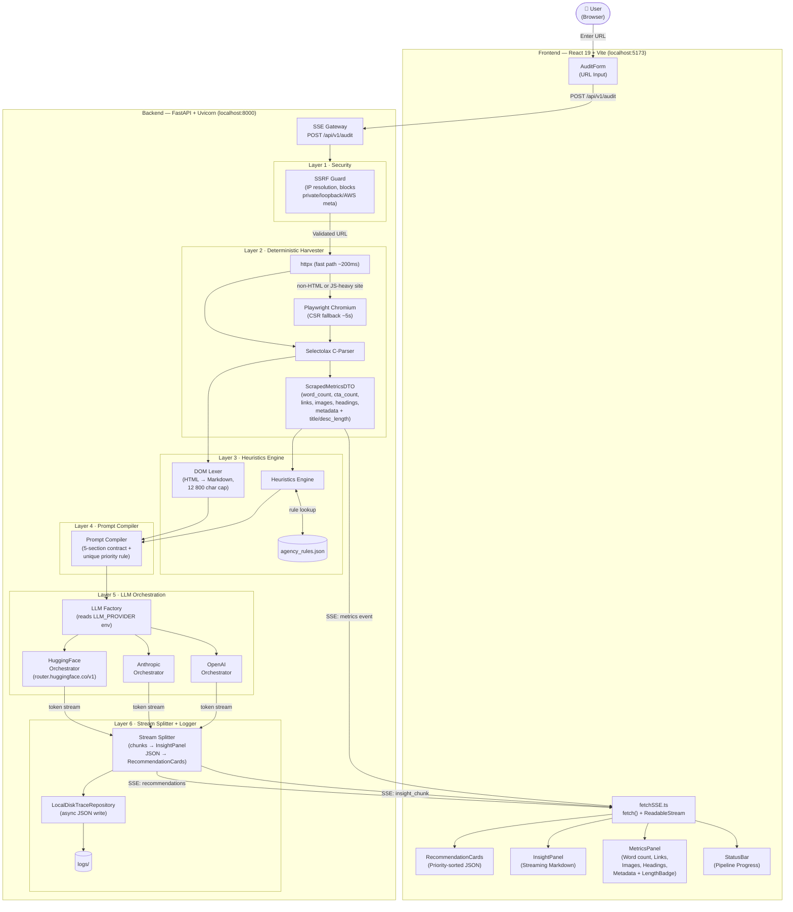

# Auditor-One: Design & Architecture Report

This document compiles the core architectural specifications, design decisions, technical trade-offs, and future roadmap items for **Auditor-One**, an AI-Native website audit tool.

---

## 1. Architecture Overview

Auditor-One uses a decoupled model consisting of a **React 19 SPA frontend** communicating with a **FastAPI backend engine** using a unidirectional event stream (**Server-Sent Events**).

### 📐 System Flowchart


### 🔄 Data Flow Summary

| Stage | What happens | Source file |
|---|---|---|
| **1 — Input** | User submits URL | Frontend |
| **2 — SSRF Check** | IP resolved, private ranges blocked | `security/ssrf_guard.py` |
| **3 — Harvest** | httpx fetches HTML; Playwright fallback for CSR/non-HTML pages | `scraper/harvester.py` |
| **4 — Parse** | Selectolax extracts metrics into DTOs | `scraper/harvester.py` |
| **5 — Metrics SSE** | `metrics` event streamed to frontend immediately | SSE Gateway |
| **6 — Lex DOM** | HTML stripped to Markdown, capped at 12 800 chars | `heuristics/lexer.py` |
| **7 — Heuristics** | `agency_rules.json` evaluated against DTOs | `heuristics/engine.py` |
| **8 — Prompts** | System + user prompts compiled with metric values | `prompts/compiler.py` |
| **9 — LLM Stream** | Provider chosen by `LLM_PROVIDER`; tokens streamed | `llm/` |
| **10 — Split** | `---REC_SPLIT---` delimiter separates markdown from JSON | SSE Gateway |
| **11 — Display** | Markdown → InsightPanel; JSON → RecommendationCards | Frontend |
| **12 — Log** | Full trace written async to `logs/` | `logging/trace_repository.py` |

---

## 2. AI Design Decisions & Prompting Strategy

### 📋 5-Section Output Contract
The system prompt enforces a strict structure the LLM must follow:
```
## SEO Structure
## Messaging Clarity
## CTA Usage
## Content Depth
## UX Concerns
---REC_SPLIT---
[JSON array of 3–5 recommendations]
```
Each recommendation must match:
```json
{
  "priority": 1,
  "category": "SEO | Copywriting | UX | Conversion",
  "issue": "...",
  "actionable_recommendation": "...",
  "metric_reference": "cta_count | metadata.title_length | ..."
}
```
Priority integers must be **strictly unique and sequential** — the backend normalises duplicates as a safety net.

### 🪙 Token Economy
*   **Selectolax over BeautifulSoup4** — C-parser processes large DOMs in under 10ms vs 100ms+ for BS4.
*   **12 800-char cap** — The DOM Lexer strips scripts/styles/SVGs and converts to Markdown. Cap keeps cost predictable and prevents context overflow.

### 🚗 Hybrid Harvester
| Path | When | Speed |
|---|---|---|
| httpx | Server-rendered HTML | ~200ms |
| Playwright | Non-HTML Content-Type or thin shell (JS/CSR) | ~5s |

Playwright wait strategy: `domcontentloaded` (30s timeout) + `wait_for_function(innerText > 100 chars, 12s)`.

---

## 3. Technical Trade-offs

| Decision | Trade-off | Rationale |
|---|---|---|
| **Strategy Pattern for LLM providers** | Slightly more files, but zero coupling | Swap providers via `.env` only without changing codebase. |
| **SSE over WebSockets** | One-way, simpler | No WebSocket upgrade handshake needed; standard HTTP streaming works perfectly. |
| **`fetch()` + `ReadableStream`** | `EventSource` is GET-only | Audit endpoint needs `POST` to carry the URL payload. |
| **Local disk trace logging** | Avoids requiring a database | Async write never blocks the stream, keeping execution time low. |
| **SSRF IP resolution** | Adds ~5ms TTFB | Non-negotiable for a web-scraping proxy to prevent local intranet exploits. |

---

## 4. What would you improve with more time (Future Improvements)

1.  **Streaming JSON parsing**: Recommendations are buffered until `---REC_SPLIT---`. Using `ijson` could yield cards one by one as they stream from the LLM.
2.  **Audit history**: Replace `logs/` disk writes with SQLite/PostgreSQL for time-series comparison.
3.  **Auth layer**: No authentication is currently provided; suitable for local dev only.
4.  **Rate limiting**: No per-IP throttle; a cloud deployment needs `slowapi` or a gateway limiter.
